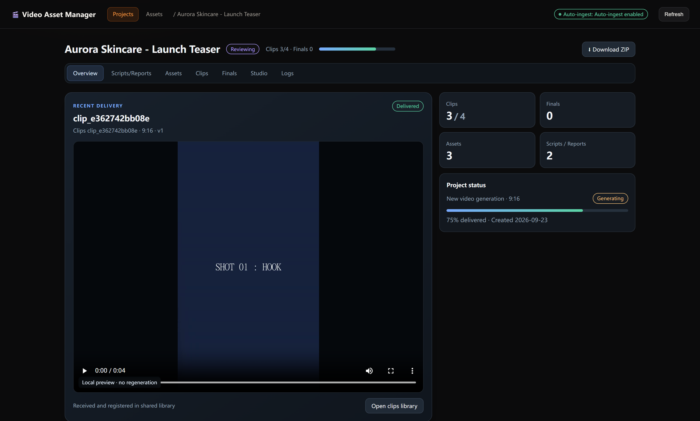
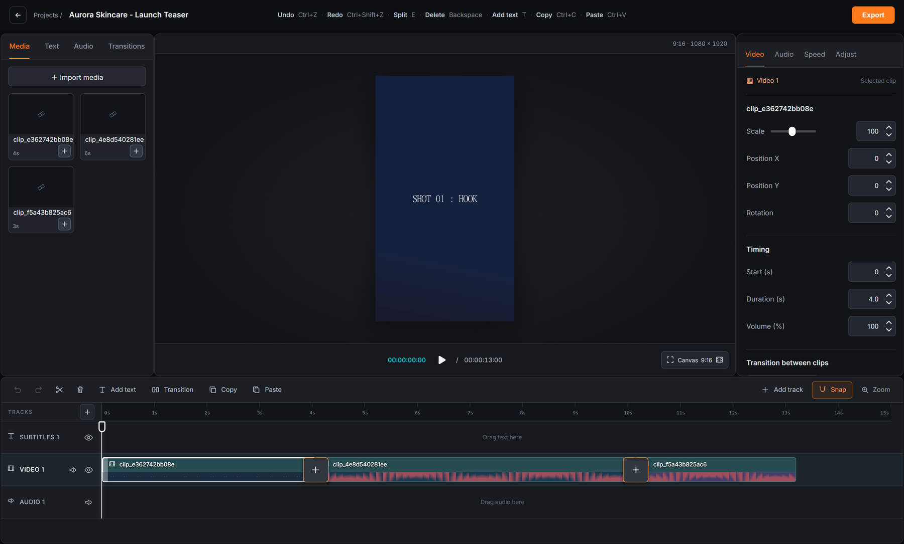
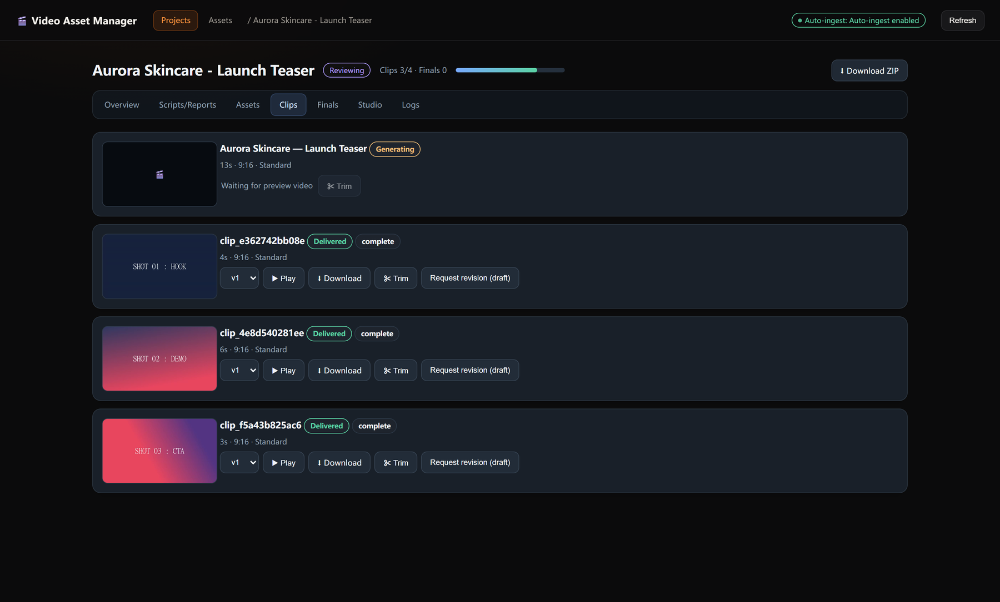

# Video Asset Manager

**English** | [简体中文](README.zh-CN.md)

A local video-project workspace with a browser-based editor — plus a companion
skill that gives every AI video-generation run a project to live in.


---

## What this is

AI video generation is stateless. You describe a clip, a model renders it, and
you get a file — usually in a downloads folder, disconnected from the script
that produced it, the reference images you supplied, the versions before it, and
the edits you made after. Six generations later the project exists only as a
pile of files with model-generated names.

Video Asset Manager gives that work a home.

It is two things in one package:

1. **A standalone web application.** A project workspace and a timeline editor.
   Create a project, keep its scripts and source media together, receive
   generated clips as append-only versions, cut them together on a six-track
   timeline, and export or archive the result. Pure Python standard library and
   vanilla HTML/CSS/JS — no Node, no npm, no build step, no database.

2. **A companion skill for an AI host.** When a video-generation skill runs, the
   manager opens the project *before* generation starts and registers the
   finished clip *after* it lands, so the script, the reference assets, every
   version, and the edit history stay attached to the work that produced them.

It is **generator-neutral**. It never calls a video provider, never holds a
credential, never rewrites a prompt, and never starts a generation. It manages
the project around your generator of choice.

## Screenshots

**Project overview** — delivery status, counts, and the most recent result:



**Studio** — six-track timeline with waveforms, media bin, and inspector:



**Clips** — every generation is an append-only version with its own actions:



## Highlights

**Project workspace**

- Projects, public scripts and reports, uploaded and generated media, clip
  versions, finals, and an activity log.
- Every delivered clip is an append-only version (`v1`, `v2`, …). Nothing
  overwrites a result you have already seen.
- Deletion is soft — projects move to `trash/`, records become `superseded`.
- One-command ZIP export of a project's public contents.

**Studio timeline editor**

- Six bounded tracks: `video-main`, three picture-in-picture lanes, `audio-main`,
  and `text-main`.
- Trim, split, ripple-delete, duplicate, drag to reorder, and edge-drag on the
  timeline.
- Picture-in-picture transforms: position, scale, rotation, opacity, and border.
- Transitions: `cut`, `fade`, `dip_black`, `dip_white`.
- Playback speed presets (0.5× / 1× / 1.5× / 2×).
- Manual subtitles with four text presets, per-cue styling, and SRT/VTT
  import and export. Subtitles are burned in at render time through ffmpeg.
- Undo/redo, frame-level stepping, an adaptive ruler (1/2/5/10 frames → seconds →
  minutes, thinning automatically as the project grows), and snapping that always
  resolves onto the project frame grid.
- Canvas presets for `16:9`, `9:16`, `1:1`, and `4:5`.

**Rendering and media**

- Asynchronous preview and export jobs. Preview writes proxies; export encodes
  with `libx264` at selectable quality tiers.
- Timeline commits are revisioned with optimistic concurrency — a stale write
  gets HTTP `409` and changes nothing, so a failed render can never corrupt the
  edit.
- Generated posters, filmstrips, waveforms, and proxies, plus ffmpeg-backed
  local trims and concat previews.
- Best-effort AAC audio extraction from every delivered video, tagged with its
  generated provenance.

**Result intake**

- A completion bridge (`receive.py`) accepts a video file, a result JSON
  document, or a whole result directory.
- Idempotent by task ID plus a SHA-256 content digest, so re-delivering the same
  result is a no-op instead of a duplicate clip.
- A directory watcher for generators that only write files, and an inbox
  scanner (`vpm_sync.py`) for results delivered out of band.
- Failed, partial, and cancelled results are recorded honestly as status — they
  never masquerade as a playable clip.

**Privacy by design**

- Every project file, log, sidecar, and ZIP is treated as user-visible.
- Credentials, API keys, signed URLs, private prompts, internal prompt
  transformations, provider and model names, money data, raw stack traces, and
  absolute paths outside the project are never persisted.
- The launcher strips every generator credential variable (`*_API_KEY` and the
  names enumerated in `scripts/vpm_privacy.py`) from the manager's own child
  processes — the manager does not need them.
- The receiver refuses bare `prompt` / `original_prompt` / `user_prompt` fields
  on purpose: they may carry a private transformed prompt. Only
  `input_script` / `public_script` is accepted as the user-visible input.

**Fail-open**

- Every companion action is best-effort. A missing launcher, a port conflict, a
  timeout, or a receive error reports a warning and **never** blocks, delays, or
  retries the generator. Generation always continues.

## Requirements

- **Python 3.10 or newer.** The service and every script use the standard
  library only.
- **FFmpeg and ffprobe on `PATH`** — recommended, not required. They power
  previews, export, thumbnails, waveforms, and audio extraction. Use a build
  with the `subtitles` filter if you want burned-in subtitles. Without ffmpeg,
  project management, intake, and editing still work; media derivatives are
  skipped with a warning.
- **A modern browser** and a writable data directory.

There is no Node.js, no npm install, no frontend build, and no external
database.

## Quick start

Clone the repository, then start the application with a data directory outside
the source tree:

```sh
python -B assets/webapp/ensure.py open --root ../vam-data --port 4200 --bind 127.0.0.1
```

Open <http://127.0.0.1:4200/>.

`../vam-data` is an example — use any writable path, and pass the same `--root`
to every command. The launcher installs its runtime copy there, starts or
reuses the service, performs an initial handoff scan, and prints a JSON result.
`-B` keeps Python from writing bytecode caches into the source package.

To run the server in the foreground instead:

```sh
python -B assets/webapp/server.py --root ../vam-data --port 4200 --bind 127.0.0.1
```

Use one startup method at a time. `Ctrl+C` stops a foreground server. The health
endpoint is `GET /api/health`.

`ensure.py open` also emits a host window request. A compatible AI host can use
it to open or focus the management page; in a plain terminal, open the URL
yourself. A successful service start alone does not mean a hosted window opened.

## Use it as a skill

Install the complete `video-asset-manager` folder into your host's skill
directory, or upload it through the host's skill installer. Keep `SKILL.md`,
`scripts/`, `assets/`, `references/`, and the bundled licenses together —
copying `SKILL.md` alone will not work.

[`SKILL.md`](SKILL.md) defines the companion lifecycle:

1. **Prepare.** While a video-production request is actionable, create or reuse
   the project and record the public inputs (title, script, supplied images)
   *before* the generator asks its first operational question or submits a task.
2. **Generate.** Run the selected generator unchanged. The manager does not
   participate in generation.
3. **Receive.** Register every terminal result exactly once — success, partial,
   or failure — so the project reflects what actually happened.

The manager also keeps *continuity* across a "deliver → edit → generate again"
loop. Edits made in the browser are written to an append-only log; before the
next generation request, the unacknowledged delta is summarised into a bounded
context object and can be handed to the generator as explanatory context. A
draft message typed into the editor is never executed on its own.

Skill selection and automatic window focus depend on the host honouring this
contract. Discussion-only requests — brainstorming, rewriting, translating,
critiquing, planning — stay dormant and never create a project.

## Receive a generated video

After a generator writes an output file, register it:

```sh
python -B scripts/receive.py ../video-output/final.mp4 \
  --root ../vam-data \
  --task-id demo-task-001 \
  --title "Product demo" \
  --script "A short product reveal." \
  --no-open
```

Use `--project <slug>` to target an existing project and `--clip <clip-id>` to
add a version to an existing clip. Keep the task ID stable when retrying the
same delivery; give each new generation its own ID.

A generator that emits structured output can hand over a result document
instead:

```json
{
  "task_id": "demo-task-001",
  "status": "completed",
  "title": "Product demo",
  "video_file": "final.mp4",
  "input_script": "A short product reveal.",
  "message": "Video generated."
}
```

```sh
python -B scripts/receive.py --result ../video-output/result.json --root ../vam-data
```

For a generator that only writes files, watch its output directory:

```sh
python -B scripts/vpm_receive.py watch ../video-output --root ../vam-data --interval 2
```

## Command-line reference

All commands run from the repository root and accept `--root`.

| Command | Purpose |
| --- | --- |
| `assets/webapp/ensure.py open` | Install/start/reuse the service, scan handoffs, return the window route. `start` and `sync` subcommands are also available. |
| `assets/webapp/server.py` | Run the HTTP service in the foreground. |
| `scripts/receive.py` | **The completion hook.** Accepts a video file, result JSON, or result directory; stages the handoff and registers it once. |
| `scripts/vpm_prepare.py prepare` | Create or reuse a project and record public inputs before generation. |
| `scripts/vpm_receive.py watch <dir>` | Watch an output directory and forward stable results through the same path. |
| `scripts/vpm_sync.py` | Scan an existing handoff inbox and register terminal results. |
| `scripts/vpm_record.py` | Atomic bookkeeping: `create`, `segments`, `plan`, `confirm`, `start`, `delivery`, `asset`, `script`, `final`, `assemble`, `official`, `status`, `active`. |
| `scripts/vpm_context.py read\|ack` | Read or acknowledge the edit-log delta for the next generation request. |
| `scripts/handoff.py` | Low-level: register one task document in an **existing** project. |

Useful flags: `--no-open` (register without touching the runtime), `--no-sync`
(stage without scanning), `--task-dir` (separate inbox), `--map` (explicit
task→project mapping), `--once` / `--interval` (watcher behaviour), `--no-start`
(do not start the service).

`receive.py` returns JSON on stdout: exit `0` for reported success, `1` for a
processing error, `2` for invalid CLI usage. Read the payload too —
`handoff_written` confirms staging, not completed registration, and `imported`,
`idempotent`, or `pending` describe what the scanner actually did.

## HTTP API

The service is a `ThreadingHTTPServer` with manual routing. Notable endpoints:

```text
GET  /api/health
GET  /api/projects
GET  /api/project/{slug}
GET  /api/project/{slug}/timeline
POST /api/project/{slug}/timeline/commit
POST /api/project/{slug}/render
GET  /api/project/{slug}/render/{job_id}
GET  /api/project/{slug}/zip
GET  /api/project/{slug}/download?file=REL_PATH
```

A timeline commit is a batch of bounded operations validated against an
allowlist (`add`, `remove`, `move`, `split`, `trim`, `duplicate`, `set_speed`,
`set_transform`, `set_transition`, `set_canvas`, `set_caption`, `set_audio`,
`undo`, `redo`, `ripple_delete`, and a few more), applied atomically against a
`base_rev`:

```json
{
  "base_rev": 12,
  "operations": [
    {"op": "move", "item_id": "tl_main_01", "start": 1.5}
  ]
}
```

A stale `base_rev` returns HTTP `409` with the current revision and leaves the
project untouched. See [`references/project-schema.md`](references/project-schema.md)
for the full data contract.

## Project layout

Projects are plain directories. Copying one copies the project; derived media
can always be rebuilt.

```text
<manager-root>/
  index.json                    # project list projection
  active_project                # current project slug
  trash/                        # soft-deleted projects
  <project-slug>/
    project.json                # schema 2 manifest
    state.json                  # recoverable task state
    assets/
      uploads/ generated/ scripts/ reports/
    clips/<clip_id>/vN.mp4      # append-only clip versions
    output/
      final_vN.mp4 exports/
    media/
      posters/ proxies/ filmstrips/ waveforms/
    subtitles/
    tasks/                      # sanitized task summaries
    logs/
      edits.log timeline.jsonl
```

The manifest groups assets logically — `asset.scripts`, `asset.media`,
`asset.clips`, `asset.finals` — while the folders stay conventional and
portable. Every path in a project field is project-relative; absolute paths,
`..`, drive letters, and symlink escapes are rejected.

## Configuration

The manager root resolves in this order:

1. An explicit `--root` argument.
2. `VIDEO_ASSET_MANAGER_ROOT`.
3. `VPM_ROOT` (legacy compatibility).
4. A workspace default path.

Environment variables:

| Variable | Effect |
| --- | --- |
| `VIDEO_ASSET_MANAGER_ROOT` | Manager data root. |
| `VPM_ROOT` | Legacy alias for the same. |
| `VAM_PORT`, `VPM_PORT` | Port (default `4200`). |
| `VAM_BIND` | Bind address (default `0.0.0.0`). |
| `VIDEO_GENERATOR_HANDOFF_DIR` | Directory scanned for terminal handoffs. |
| `VIDEO_GENERATOR_TASK_DIR`, `VAM_HANDOFF_DIR` | Legacy aliases for the same. |
| `VIDEO_GENERATOR_OUTPUT_DIR` | Generator output directory to import from. |

## Security

**The application has no built-in login and no per-user authorization.** Anyone
who can reach the port can read, download, modify, and delete its project data.

The runtime's default bind is `0.0.0.0:4200`, which is intended for forwarded
hosting. For local-only use — which is what the quick-start commands above do —
bind to loopback:

```sh
python -B assets/webapp/ensure.py open --root ../vam-data --bind 127.0.0.1
# or
VAM_BIND=127.0.0.1 python -B assets/webapp/ensure.py open --root ../vam-data
```

If you host it, put it behind an authenticated gateway and do not expose the
port directly to an untrusted network. Read [`PUBLISHING.md`](PUBLISHING.md)
before deploying a copy. Note also that a container's loopback address is not a
valid URL from a different machine.

## Tests

```sh
python -m unittest discover -s scripts/tests
node scripts/tests/test_editor_geometry.cjs
```

91 Python tests across six files (handoff end-to-end, receive and idempotency,
preparation, edit-log context, server latency and caching, bundled license
integrity), plus 11 Node tests covering editor geometry. No test needs external
network access; all HTTP is loopback. The one ffmpeg-dependent test skips itself
when ffmpeg is absent.

## Repository layout

```text
video-asset-manager/
  README.md                 This file
  SKILL.md                  Host routing and companion lifecycle contract
  PUBLISHING.md             Distribution, licensing, and network notes
  assets/webapp/            Web application and runtime launcher
    licenses/               Font licenses and third-party notices
  scripts/                  Intake, handoff, recording, and context tools
    tests/                  Regression tests
  references/
    project-schema.md       Authoritative project and handoff data contract
  docs/screenshots/         Images used in this README
```

Generated projects, media, logs, credentials, and runtime state do not belong in
the source tree. `.gitignore` covers the usual offenders, but it does not filter
a manually created ZIP — inspect the staged files before publishing.

## Scope

The manager's editor boundary is deliberate. It is **not** a full non-linear
editor and does not aim to become one. Out of scope: speech recognition,
animated captions, keyframes, masks, filter libraries, advanced text templates,
unlimited tracks, advanced audio mixing, speed curves, real-time collaboration,
publishing, and cloud deployment. It also does not generate video, call a
provider, or alter any generator's contract.

## Licensing and third-party notices

**No repository-wide source license is granted by this repository.** If you
intend to reuse the code, contact the author; if you are the author, choose and
add a `LICENSE` file before publishing.

Bundled third-party material is documented in
[`assets/webapp/licenses/`](assets/webapp/licenses/README.md):

- **Five fonts** (`Inter`, `Roboto`, `Bebas Neue`, `Dancing Script`,
  `Playfair Display`) are redistributed under the **SIL Open Font License 1.1**,
  verified byte-for-byte against a pinned revision of the Google Fonts
  repository, with SHA-256 and git blob hashes recorded. Keep the license files
  with the fonts when redistributing. Font licenses do not apply to the
  application source or to videos rendered with the fonts.
- **Two canvas-snapping and edge-scrolling functions** were replaced with
  implementations written from functional specifications. The historical source
  attribution and license terms are retained in
  [`tooscut-NOTICE.md`](assets/webapp/licenses/tooscut-NOTICE.md).
- **OpenReel** and **OpenCut** were identified as implementation references;
  their verified MIT notices are retained for any reused portions. See
  [`editor-sources.md`](assets/webapp/licenses/editor-sources.md).

Do not describe this package as MIT-licensed or fully license-cleared on the
basis of the font notices.

## Status

Early and actively evolving. The project data contract (`schema: 2`,
see [`references/project-schema.md`](references/project-schema.md)) is
versioned and readers must accept schema-1 manifests. Project data is written
atomically and never silently coerced — if you find a case where it is, that is
a bug worth reporting.
